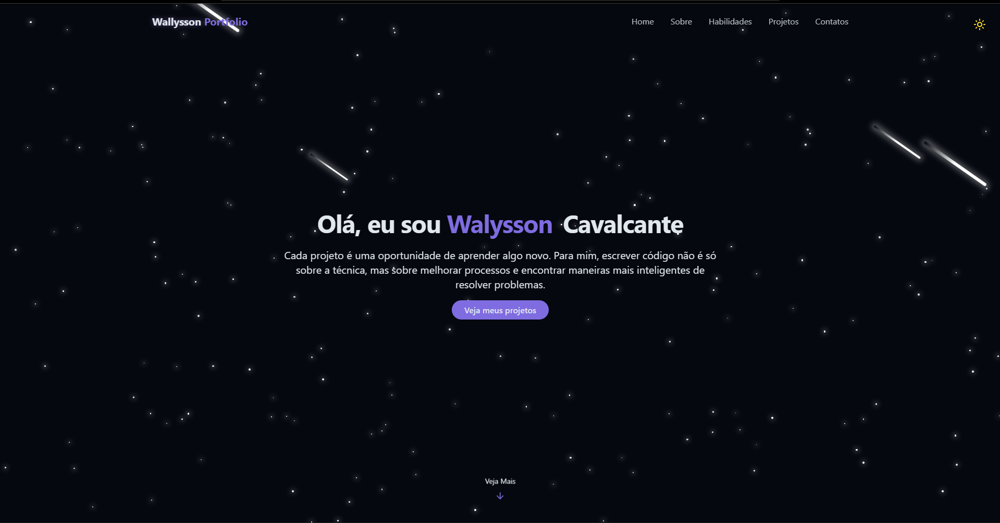

## Portfólio - Wallysson Cavalcante

Este é o repositório do meu portfólio pessoal, uma aplicação web desenvolvida com Next.js, TypeScript e Tailwind CSS. O objetivo é apresentar minhas habilidades, projetos e um pouco sobre minha jornada como desenvolvedor.

Cada projeto é uma oportunidade de aprender algo novo. Para mim, escrever código não é só sobre a técnica, mas sobre melhorar processos e encontrar maneiras mais inteligentes de resolver problemas.

## 📸 Preview



## 🚀 Funcionalidades

✅ Design Moderno e Responsivo: Interface limpa e totalmente adaptável a qualquer dispositivo, construída com Tailwind CSS.
✅ Animação de Fundo Interativa: Uma experiência visual imersiva com um background de estrelas e cometas.
✅ Seções Dedicadas: Apresentação clara de informações nas seções: Sobre, Habilidades, Projetos e Contato.
✅ Performance Otimizada: Construído com Next.js para garantir carregamento rápido, renderização no servidor (SSR) e ótima performance de SEO.
✅ Tipagem Estática: Código mais robusto, legível e com menos bugs graças ao uso do TypeScript.

## 🛠️ Tecnologias Utilizadas

Next.js 14
React
TypeScript
Tailwind CSS

## 📦 Como Executar o Projeto

Primeiro, clone o repositório:

```Bash

git clone https://github.com/WalyssonCavalcante/Portifolio.git
Acesse a pasta do projeto:
```

```Bash

cd Portfolio
Instale as dependências:
```

```Bash

npm install
Inicie o servidor de desenvolvimento:
```

```Bash

npm run dev
Agora, abra http://localhost:3000 no seu navegador para ver o projeto em execução.
```
